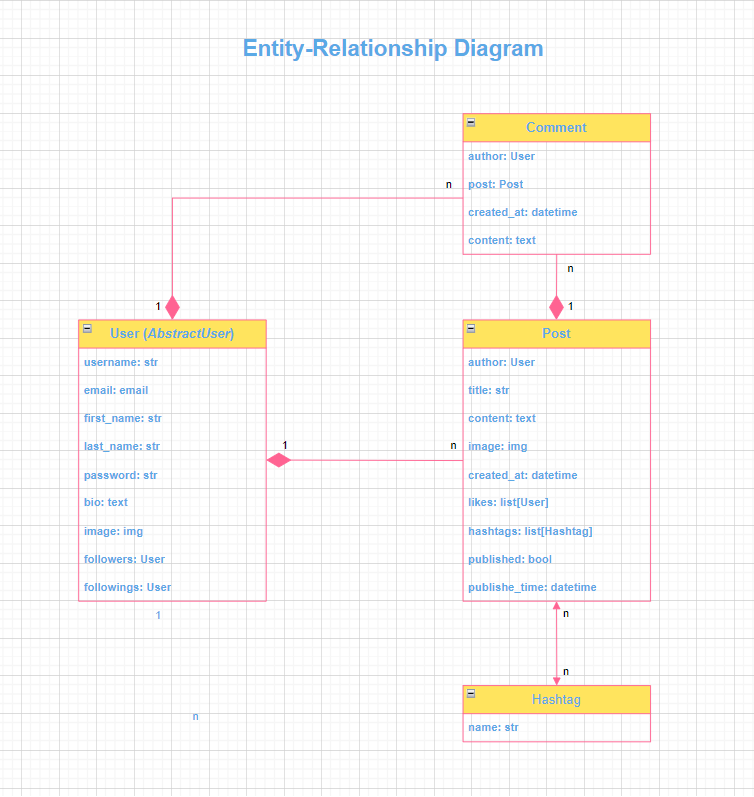
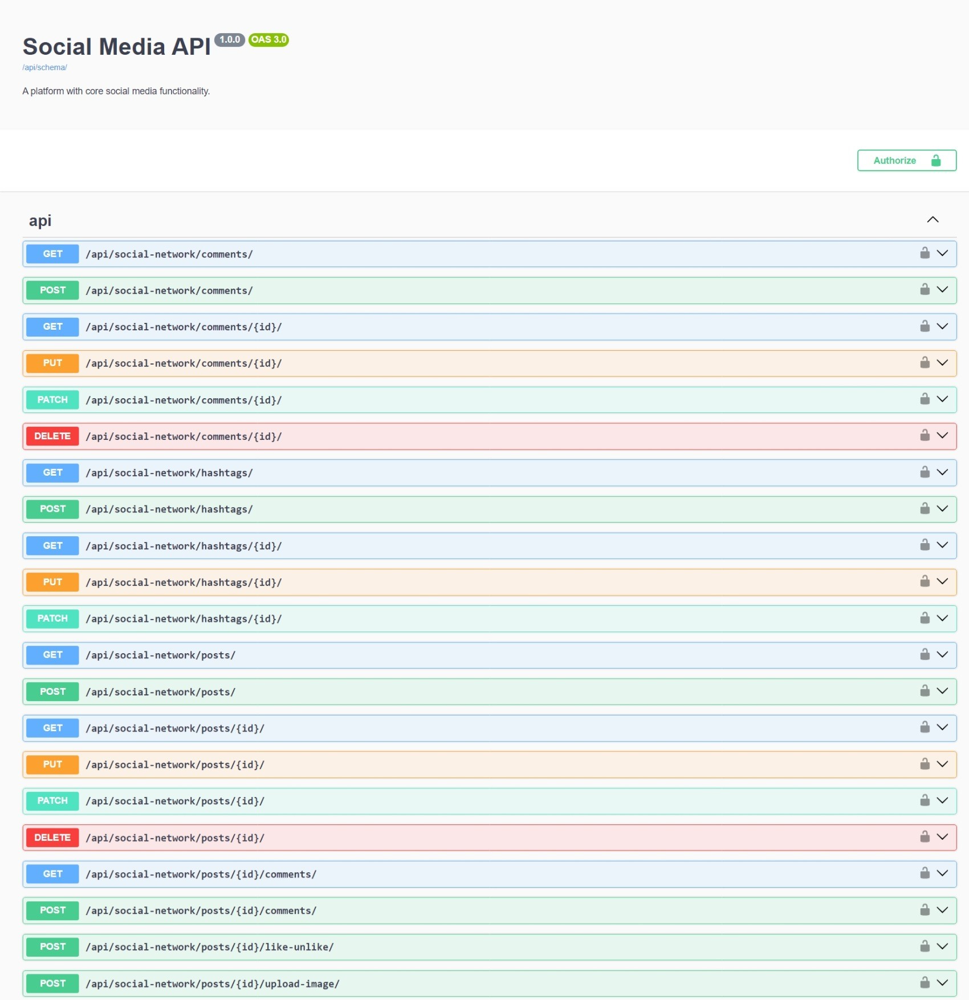
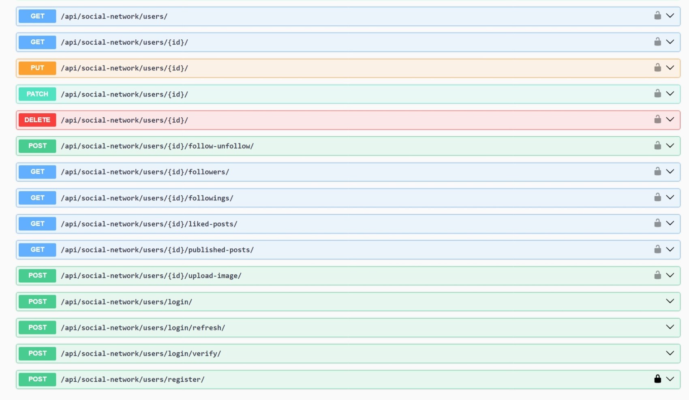

# Social Media API

## Introduction

Welcome to the Social Media API!
This API has been developed to create interactive platform which establishes social networking and ensures 
social interaction on basic level.

## Features

* Initially registration and authentication are required to get access to all the features.
* Authenticated users can follow other users, create and retrieve posts, reacting to them by likes and comments, 
and conduct necessary social media actions.
* Users are allowed to update and delete only their own posts.
* Users are able to manage only their own posts and comments.
* Searching option applicable to users is their last name as distinctive attribute. Searching options applicable to
posts are hashtag, title and author's last name.
* Hashtags are overarching relevant criteria which enable users to categorize and organize posts.
* Users can schedule posts for future publication.
* Additionally users can upload images to their profiles and to their posts.

## Installation

Clone this repository:

   ```bash
   git clone https://github.com/callogan/social-media-api
   cd social-media-api
   ```

* The main branch is considered as the most sustainable branch, therefore it is recommended to work from it.

* If you intend to run the application locally, follow the next steps:

1. Create the virtual environment:

   ```bash
   python -m venv venv
   ```

2. Activate the virtual environment:

   On Windows:

      ```bash
      venv\Scripts\activate
      ```

   On macOS and Linux:

      ```bash
      source venv/bin/activate
      ```

3. Install dependencies:

   ```bash
   pip install -r requirements.txt
   ```

4. Copy this file ".env.sample" and rename it to ".env", then fill in the actual values for your local environment.
5. Apply the migrations:

   ```bash
   python manage.py migrate
   ```

6. In order to run the development server, use the following command:

   ```bash
   python manage.py runserver
   ```

* You might as well run the application via the Docker. For this purpose make certain the Docker is installed 
on your computer and follow the next steps:
1. Fill the actual data for ".env" file (as was mentioned above).
2. Build the Docker image and start the containers for the application and the database:
   ```bash
   docker-compose up --build
   ```

Access the application in your web browser at http://localhost:8000.

## Technologies

* [Django REST Framework](https://www.django-rest-framework.org/) This is the toolbox for designing Web APIs, providing 
features such as serialization, authentication, API views and viewsets to streamline the development of RESTful services
in Django applications.
* [Celery](https://docs.celeryq.dev/en/stable/) This is the system to operate task queue with focus on real-time 
processing and option to schedule tasks.    
* [Redis](https://redis.io/) This is a source available, im-memory storage, used as distributed, in-memory key-value 
database, cache and message broker.
* [Docker](https://www.docker.com/) This is open source containerization platform that enables developers to package 
applications into containers, simplifying the process of building, running, managing and distributing applications 
throughout different execution environments.
* [PostgreSQL](https://www.postgresql.org/) This is a powerful, open source object-relational database management 
system.
* [Swagger](https://swagger.io/) This is open source suite of tools to generate API documentation.

Authentication of users is incorporated with means of JSON Web Tokens.

## Demo





## Copyright

Copyright (c) 2024 Ruslan Kazmiryk
